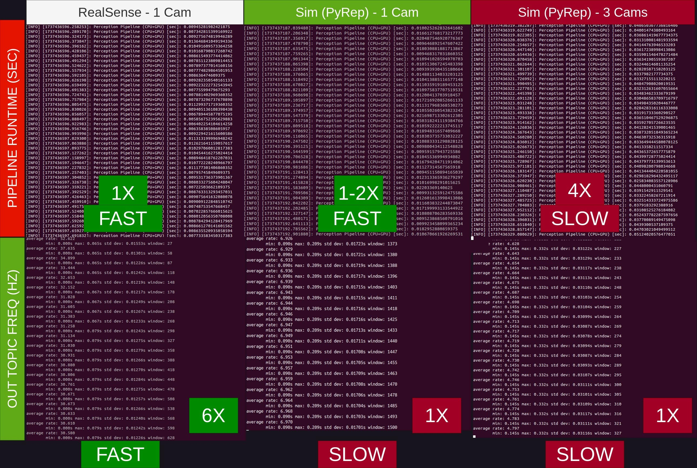

# Perception Pipeline

Goal: Fast (~30Hz) perception pipline for workspace approximation research for heuristic-based multi-agent planning framework (PMAF) by Laha et al 2023. Support both sim/real-world perception for multiple cameras.

## Requirements

| Hardware Stack                                     |
| ---------------------------------------------------- |
| 1. CUDA-capable PC (Our Setup: i7 8000U + RTX3070) |
| 2. Intel Realsense 435i (for Real-World)           |
| 3. Franka Emika Panda Robot Arms (for Real-World)  |

| Software Stack                                                                                                      |
| --------------------------------------------------------------------------------------------------------------------- |
| 1. Ubuntu 20.04 Focal Fossa ([iso](https://releases.ubuntu.com/focal/https:/))                                      |
| 2. ROS 1 Noetic ([debian](http://wiki.ros.org/noetic/Installation/Debianhttps:/))                                   |
| 3. Conda + CUDA ([instructions](https://x.com/jeremyphoward/status/1697435241152127369))                            |
| 4. librealsenseSDK ([debian](https://github.com/IntelRealSense/librealsense/blob/master/doc/distribution_linux.md)) |
| 5. CoppeliaSim 4.1.0 EDU (for simulation,[binaries](https://www.coppeliarobotics.com/previousVersionshttps:/))      |

## Setup

- Install aforementioned requirements and clone this git repo
- Run `./setup.sh` - this will create a virtual environment and install all dependencies and libraries
- Set `$COPPELIASIM_ROOT` to the CoppeliaSim installation directory (for simulation)

## Credits

### Collaborators

- Riddhiman Laha
- Tinayu Ren

### Projects

- CuPoch
- Open3D
- CoppeliaSim
- PyRep (by stepjam)

## Performance

Performance w/o RBS:

