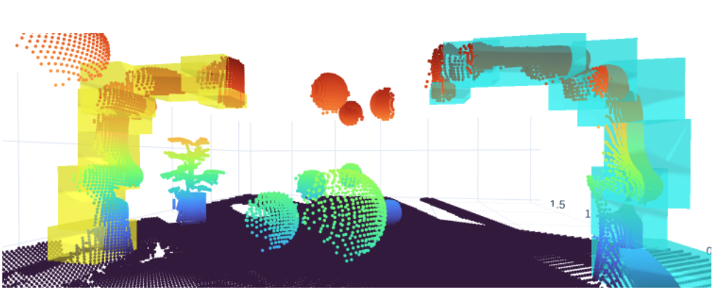

# Perception Pipeline

Goal: Fast (~30Hz) perception pipline for generating control parameters and workspace approximation for multi-agent cooperation (PMAF, Laha et al 2023) in tight-constrained scenes. 




<!--  -->


### Generate Data
```
cd $PERCEPT_ROOT
source peract_env/bin/activate
cd src
scripts/run_datacap.sh
```

### Run Pipeline
```
cd $PERCEPT_ROOT
source peract_env/bin/activate
cd src
python src/pipeline/3cam_pipe.py
```


### Run PMAF
```
export LD_LIBRARY_PATH=$LD_LIBRARY_PATH:$COPPELIASIM_ROOT
export QT_QPA_PLATFORM_PLUGIN_PATH=$COPPELIASIM_ROOT
cd $COPPELIASIM_ROOT && ./coppeliaSim.sh -h $PMAF_ROOT/src/bimanual_planning_ros/vrep_scenes/dual_arms.ttt

roslaunch bimanual_planning_ros vrep_interface_dual_arms.launch task_sequence:=dual_arms_static3
roslaunch bimanual_planning_ros planning_moveit_dual_arms.launch
```

### Debug
Run Coppelia
```
export LD_LIBRARY_PATH=$LD_LIBRARY_PATH:$COPPELIASIM_ROOT
export QT_QPA_PLATFORM_PLUGIN_PATH=$COPPELIASIM_ROOT
cd $COPPELIASIM_ROOT && ./coppeliaSim.sh
```


## Credits

### Collaborators
- Riddhiman Laha
- Tinayu ...

### Projects
- CuPoch
- Open3D
- CoppeliaSim

